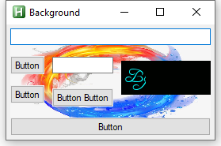

---
hide:
  - toc
---
# Example Background

---
<figure markdown="1">
 
</figure>

```AutoHotkey
#Include <GridGUI>

myGui := new GridGUI("Background", "resize")
myGui.GuiClose := GridGUI.ExitApp

oWB := myGui.Add(3, "2-3", "ActiveX", "w113 h43", "shell explorer").vVar
oWB.Navigate("about:<!DOCTYPE HTML><html><body style=""{margin:0;}""></body></html>")
oWB.document.body.style.overflow := "hidden"

ctrl := myGui.Add("1-3", "1-5", "Picture", "w0 h0", "Images\background.png", , , 1, 1)
myGui.RegisterBackground(ctrl)

myGui.Add("1-3", 1, "Edit", , , 1, , 1)
myGui.Add(1, 2, "Button", , "Button")
myGui.Add(2, 2, "Edit", "w0", , 1, 1, 1)
myGui.Add(1, 3, "Button", , "Button")
myGui.Add(2, "3-4", "Button", , "Button Button", , 1)
myGui.Add("1-3", 5, "Button", , "Button", 1, , 1)

myGui.AutoSize()
myGui.MinSize()
myGui.Show()
return
```