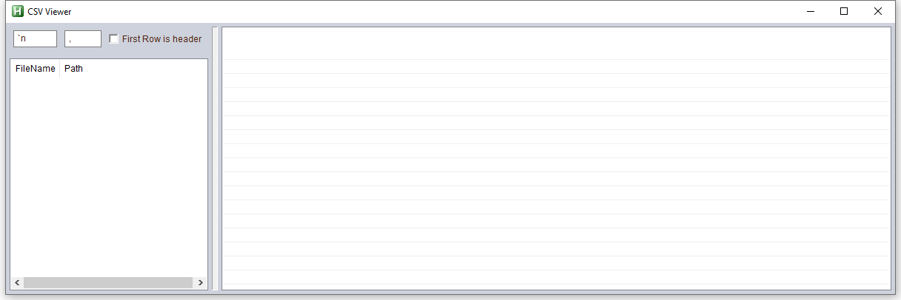

---
hide:
  - toc
---
# Example CSV Viewer

---
<figure markdown="1">
 
</figure>

```AutoHotkey
#Include <GridGUI>

; sets defaults for the scripts
SetBatchLines, -1
SetWinDelay, 0
FileEncoding, UTF-8

; used to manage changing the cursor when howering over the splitter (progress control)
global CurrentCursor := 0
global SuppressCursorChange := 0

; Creating and styling a GUI
myGui := new GridGUI("CSV Viewer", "resize")
myGui.GuiClose := GridGUI.ExitApp
myGui.Color("CED2DD")
myGui.Font("s9 c4D2609", "Helvetica")

myGui.GuiSizeDelay := false

; Creating a subgrid to hold the settings line
SubGrid := new GridGUI.SubGrid(myGui.hwnd)
; Add controls to the subgrid
;							columns	rows	ctrl		options
CB := SubGrid.Add(			3,		1,		"Checkbox",	{text: "First Row is header", justify: "WC"})
ED_RowSep := SubGrid.Add(	1,		1,		"Edit",		{text: "Row Sep", options: "-Multi", justify: "EC"})
ED_ValSep := SubGrid.Add(	2,		1,		"Edit",		{text: "Val Sep", options: "-Multi", justify: "EC"})
; Sized the subgrid so that the cue banners can be shown
SubGrid.AutoSize()
SubGrid.MinSize()

; Sets the edit controls to default values
ED_RowSep.GuiControl("", "``n")
ED_ValSep.GuiControl("", ",")

; Creating the main ListView and header state handler
LV := new GridGUI.ListviewControl(myGui.hwnd, "+Grid")
LV_HS := new HeaderState(LV)

; Creating the file list ListView
LV_FL := new GridGUI.ListviewControl(myGui.hwnd, "AltSubmit -Multi", "FileName|Path")

; Add controls to the GUI
;					columns	rows	ctrl		options
myGui.AddControl(	"1-2",	1,		SubGrid,	{justify: "WC"})
myGui.AddControl(	"1-2",	2,		LV_FL,		{options: "r10", exH: 1, fillW: true, fillH: true})
myGui.AddControl(	4,		"1-2",	LV,			{exW: 1, exH: 1, fillW: true, fillH: true})
SP := myGui.Add(	3,		"1-2",	"Progress",	{options: "w8", fillH: true})
; Removing the horizontal margin of the splitter
myGui.GetNewestCellGroup().borderX := 0

; Adding file drag and drop for the ListBox
myGui.RegisterDropTarget(LV_FL, Func("AddFiles").Bind(LV_FL))

; Add user input handling
LV_FL.Callback := Func("FileSeleted").Bind(LV_FL, LV, LV_HS, ED_RowSep, ED_ValSep)
CB.Callback := Func("AddHeader").Bind(CB, LV_HS)

; Sets cue banners for the edit controls
EM_SETCUEBANNER := 0x1501
PostMessage, % EM_SETCUEBANNER, False, % &str := "Row Sep", , % "ahk_id " ED_RowSep.Hwnd
PostMessage, % EM_SETCUEBANNER, False, % &str2 := "Val Sep", , % "ahk_id " ED_ValSep.Hwnd

; Sets up OnMessage to handle the splitter
OnMessage(WM_LBUTTONDOWN := 0x0201, Func("DragResize").Bind(myGui, SP.hwnd, LV_FL, LV))
OnMessage(WM_MOUSEMOVE := 0x0200, Func("WM_MOUSEMOVE").Bind(SP.hwnd))
OnMessage(WM_SETCURSOR := 0x20, "WM_SETCURSOR")

; Shows the GUI
myGui.Show("w1200")
return

FileSeleted(LV_FL, LV, LV_HS, ED_RowSep, ED_ValSep) {
	if(A_GuiEvent = "Normal") {
		path := LV_FL.GetSelection()[1][2]
		LV.Redraw(0)
		LV.Delete()
		rows := []
		num_columns := 0
		
		rSep := UnEscapeSpecialCharaters(ED_RowSep.GuiControlGet())
		vSep := UnEscapeSpecialCharaters(ED_ValSep.GuiControlGet())
		
		for i, line in StrSplit(FileOpen(path, "r `n").Read(), rSep) {
			row := StrSplit(line, vSep)
			rows.Push(row)
			if(row.Count() > num_columns) {
				num_columns := row.Count()
			}
		}
		headers := []
		loop % num_columns {
			headers.Push("Header " A_Index)
		}
		LV.SetHeaders(headers)
		LV.AddArray(rows)
		LV.Redraw(0)
		LV_HS.Reset(headers, LV.GetRow(1))
		LV.ModifyCol()
		LV_HS.Update()
		LV.Redraw(1)
	}
}

AddFiles(LV_FL, files) {
	rows := []
	for i, path in files {
		SplitPath, % path, filename
		rows.Push([filename, path])
	}
	LV_FL.Delete()
	LV_FL.AddArray(rows)
	LV_FL.ModifyCol()
}

AddHeader(CB, LV_HS) {
	if(LV_HS.useRow1 != CB.vVar) {
		LV_HS.useRow1 := CB.vVar
		LV_HS.Update()
	}
}

Class HeaderState {
	useRow1 := false
	row1 := []
	headers := []
	deleted := false
	
	__New(LV) {
		this.LV := LV
	}
	
	Reset(headers, row1) {
		this.headers := headers
		this.row1 := row1
		this.deleted := false
	}

	Update() {
		if(this.useRow1) {
			if(!this.deleted) {
				this.LV.Delete(1)
			}
			this.deleted := true
			this.LV.SetHeaders(this.row1)
		} else {
			if(this.deleted) {
				this.LV.Insert(1, , this.row1*)
				this.deleted := false
			}
			this.LV.SetHeaders(this.headers)
		}
	}
}

UnEscapeSpecialCharaters(str) {
	return StrReplace(StrReplace(StrReplace(str, "``r", "`r"), "``t", "`t"), "``n", "`n")
}


; Splitter handling after this point

DragResize(gui, hwnd, ctrl, ctrl2) {
	MouseGetPos, x, y, , ctrl_hwnd, 2
	if(hwnd == ctrl_hwnd) {
		SuppressCursorChange := True
		ctrl.Redraw(0), ctrl2.Redraw(0)
		pos := ctrl.ControlGetPos()
		x3 := 0, y3 := 0
		while(GetKeyState("LButton", "P")) {
			Sleep, 25
			MouseGetPos, x2, y2
			if(x2 != x3 || y2 != y3) {
				ctrl.Options("w" pos.w + (x2 - x))
				gui.ReDraw()
				x3 := x2, y3 := y2
			}
		}
		MouseGetPos, x2, y2
		ctrl.Options("w" pos.w + (x2 - x))
		gui.ReDraw()
		SuppressCursorChange := False
		ctrl.Redraw(1), ctrl2.Redraw(1)
	}
}

WM_SETCURSOR(wParam, lParam) {
	HitTest := lParam & 0xFFFF
	if(HitTest = 1 && CurrentCursor != 0) {
		DllCall("SetCursor", "ptr", CurrentCursor)
		return true  ;Do not do further cursor processing (ie: skip default behavior)
	}
	;Else, let the system handle it
}

WM_MOUSEMOVE(ctrl_hwnd, wParam, lParam) {
	;A list of cursor constants can be found on the LoadCursor page
	;http://msdn.microsoft.com/en-us/library/windows/desktop/ms648391%28v=vs.85%29.aspx
	static doubleArrow := DllCall("LoadCursor", "ptr", 0, "ptr", 32644)
	if(!SuppressCursorChange) {
		MouseGetPos, , , , hwnd, 2
		if(hwnd == ctrl_hwnd) {
			CurrentCursor := doubleArrow
		} else {
			CurrentCursor := 0  ;Set to zero to let WM_SETCURSOR know to do nothing
		}
	}
}
```