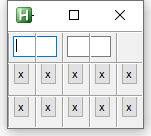

---
hide:
  - toc
---
# Example Exp Fight

---
<figure markdown="1">
 
</figure>

```AutoHotkey
#Include <GridGUI>

myGui := new GridGUI("Grid Test", "resize", true)
myGui.GuiClose := GridGUI.ExitApp

myGui.Add("1-2", 1, "Edit", "w0", , 1, , 1)
myGui.Add("3-4", 1, "Edit", "w0", , 1, , 1)
loop 5 {
	myGui.Add(A_Index, 3, "Button", , "x", 0, 0, 0, 0, "W")
	myGui.Add(A_Index, 4, "Button", , "x", 0, 0, 0, 0, "E")
}
myGui.AutoSize()
myGui.Show()
return
```