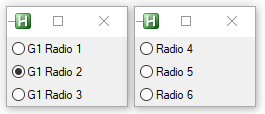

---
hide:
  - toc
---
# Example RadioGroups 2

---
<figure markdown="1">

</figure>

```AutoHotkey
#Include <GridGUI>

myGui1 := new GridGUI("Grid Test", "resize")
myGui2 := new GridGUI("Grid Test", "resize")
myGui1.GuiClose := GridGUI.ExitApp
myGui2.GuiClose := GridGUI.ExitApp

RG := new GridGUI.RadioGroupControl(myGui1.hwnd)

myGui1.AddControl(1, 1, RG.New(, "G1 Radio 1"))
myGui1.AddControl(1, 2, RG.New("Checked1", "G1 Radio 2"))
myGui1.AddControl(1, 3, RG.New(, "G1 Radio 3"))

myGui2.AddControl(1, 1, RG.New(, "Radio 4", myGui2.hwnd))
myGui2.AddControl(1, 2, RG.New(, "Radio 5", myGui2.hwnd))
myGui2.AddControl(1, 3, RG.New(, "Radio 6", myGui2.hwnd))

myGui1.AutoSize()
myGui1.MinSize()
myGui1.Show()

myGui2.AutoSize()
myGui2.MinSize()
myGui2.Show()
myGui2.Show("x" myGui1.pos.x + myGui1.pos.w)
return
```