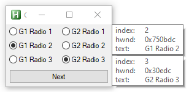

---
hide:
  - toc
---
# Example RadioGroups

---
<figure markdown="1">
 
</figure>

```AutoHotkey
#Include <GridGUI>

myGui := new GridGUI("Grid Test", "resize")
myGui.GuiClose := GridGUI.ExitApp

RG1 := new GridGUI.RadioGroupControl(myGui.hwnd)
RG2 := new GridGUI.RadioGroupControl(myGui.hwnd)

myGui.AddControl(1, 1, RG1.New(, "G1 Radio 1"))
myGui.AddControl(1, 2, RG1.New("Checked1", "G1 Radio 2"))
myGui.AddControl(1, 3, RG1.New(, "G1 Radio 3"))

myGui.AddControl(2, 1, RG2.New(, "G2 Radio 1"))
myGui.AddControl(2, 2, RG2.New(, "G2 Radio 2"))
myGui.AddControl(2, 3, RG2.New(, "G2 Radio 3"))

Bt := myGui.Add("1-2", 4, "Button", , "Next", 1, , 1)

RG1.callback := Func("ShowSelected").Bind(myGui, 1)
RG2.callback := Func("ShowSelected").Bind(myGui, 2)
Bt.callback := Func("CheckNextRadioButton").Bind(RG1, RG2)

myGui.AutoSize()
myGui.MinSize()
myGui.Show()

Sleep, 100
ShowSelected(myGui, 1, RG1.Checked)
return

CheckNextRadioButton(gr1, gr2) {
	gr1.Check(Mod(gr1.Checked["index"], 3) + 1)
	gr2.Check(Mod(gr2.Checked["index"], 3) + 1)
}

ShowSelected(gui, toolNumber, selected) {
	CoordMode, ToolTip, Screen
	ToolTip, % "index:`t" selected["index"] "`n" "hwnd:`t" selected["ctrl"].hwnd "`n" "text:`t" selected["text"], % gui.pos.x + gui.pos.w, % gui.pos.y + (toolNumber = 2 ? gui.pos.h / 2 : 0), % toolNumber
}
```