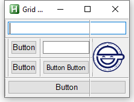

---
hide:
  - toc
---
# Example Scale

---
<figure markdown="1">
 
</figure>

```AutoHotkey
#Include <GridGUI>

SetBatchLines, -1
SetControlDelay, 0
SetWinDelay, 0

CoordMode, ToolTip, Screen

myGui := new GridGUI("Grid Test", "resize", true) ; +E0x02000000 +E0x00080000
myGui.GuiClose := GridGUI.ExitApp
		
ed1 :=	myGui.Add("1-2", 1, "Edit", "-Multi", , , , 1, , "WC")

; Adds a subgrid to split the a
		subgrid := new GridGUI.SubGrid(myGui.hwnd, , , true)
bt1 :=	subgrid.Add(1, 1, "Button", , "Button")
ed2 :=	subgrid.Add(2, 1, "Edit", "w0 -Multi", , , , 1)
bt2 :=	subgrid.Add(1, 2, "Button", , "Button")
bt3 :=	subgrid.Add(2, 2, "Button", , "Button Button")

; Sizes the subgrid so that the contained controls will be shown
subgrid.grid.justify := "WC"
subgrid.AutoSize()
subgrid.MinSize()

		myGui.AddControl(1, 2, subgrid, 1, 1, , , "WC")

; Removes the border around the first subgrid
myGui.GetNewestCellGroup().borderX := 0
myGui.GetNewestCellGroup().borderY := 0

if(!pToken := Gdip_Startup()) {
	MsgBox, 48, gdiplus error!, Gdiplus failed to start. Please ensure you have gdiplus on your system
	ExitApp
}
laugh := new GdiLaughingMan(myGui.hwnd, subgrid.pos.h - 10)

subgrid2 := new GridGUI.SubGrid(myGui.hwnd, , , true)
		subgrid2.AddControl(1, 1, laugh)
subgrid2.grid.justify := "C"
subgrid2.AutoSize()
subgrid2.MinSize()

		myGui.AddControl(2, 2, subgrid2, , , 1, 1)

; Removes the border around the second subgrid
myGui.GetNewestCellGroup().borderX := 0
myGui.GetNewestCellGroup().borderY := 0

bt4 :=	myGui.Add("1-2", 3, "Button", , "Button", , , 1, , "WC")

myGui.AutoSize()
myGui.MinSize()
myGui.Show()

ctrlFontRatio := GetTextSizeRatio([ed1, ed2, bt1, bt2, bt3, bt4])

; Makes the all the cells in the grids have their current aspect ration locked
GuiFixAspectratio(subgrid)
GuiFixAspectratio(subgrid2)
GuiFixAspectratio(myGui)

; Sets the ratio for the laughing man drawing
subgrid2.GetCellGroup(laugh).SetAspectRatio(laugh.ratio)

;myGui.Add(1, 2, "Text")

myGui.GuiSize := Func("SizeFont").Bind(myGui, ctrlFontRatio)
return

GetTextSizeRatio(ctrls) {
	res := ""
	ctrlFontRatio := {}
	for i, ctrl in ctrls {
		ctrlFontRatio[ctrl] := ctrl.logfont.PixelHeight("j") / GetClientArea(ctrl.hwnd).h
		res .= ctrlFontRatio[ctrl] "`n"
	}
	;ToolTip, % res, 0, 100, 3
	return ctrlFontRatio
}

SizeFont(gui, ctrls, delay := true) {
	res := ""
	for ctrl, ratio in ctrls {
		pos := ctrl.GetPos()
		h := pos.h * ratio
		points := Round(h * 72 / A_ScreenDPI)
		ctrl.Font("s" points, , false)
		if(ctrl.logfont.PixelWidth(ctrl.GuiControlGet("")) >= pos.w) {
			points--
			ctrl.Font("s" points, , false)
		}
		res .= points "`n"
	}
	gui.Draw(gui.pos)
	;ToolTip, % res, 0, 0, 2
}

GuiFixAspectratio(gui) {
	for i, c in gui.grid.Cells {
		gui.grid.arbitrator.Remove(c)
	}

	for i, c in gui.grid.Cells {
		c.SetAspectRatio()
		c.exW := c.pos.w / gui.pos.w
		c.exH := c.pos.h / gui.pos.h
		c.fillW := true
		c.fillH := true
		gui.grid.arbitrator.Add(c)
	}
	gui.grid.arbitrator.IsReduced := false
}

GetClientArea(hwnd) {
	local RECT
	VarSetCapacity(RECT, 16, 0)
	DllCall("GetClientRect", "UInt", hwnd, "UInt", &RECT)
	return new GridGUI.Position(NumGet(RECT, 0, "int"), NumGet(RECT, 4, "int"), NumGet(RECT, 8, "int"), NumGet(RECT, 12, "int"))
}

#include Example GDI.ahk
```