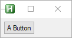
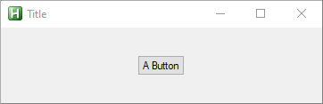
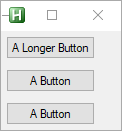
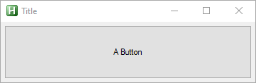
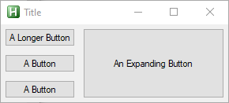
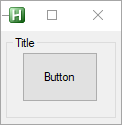
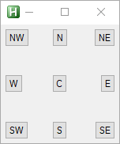

# How to Use

----
<figure markdown="1">
##Introduction
----
**GridGUI** is a library that allows placing Controls relative to eachother without being limited in the order that they are placed, as well as automatically resizing Controls.

**How it works:** By adding Controls to an instance of [GridGUIClass](Classes/GridGUIClass.md) they will be placed relative to each other so that no row/column will ever be in another although they can have zero area.

**You will need:** The main source file and the lib directory in the same directory, if you add it to your lib directory then you might want to change the name of the lib directory from this project.

##How to use
</figure>
----
After inclusion of *GridGUI.ahk* in a script a [GridGUIClass](Classes/GridGUIClass.md) instance can be made like this.
```AutoHotkey
myGui := new GridGUI("Title", Options := "resize")
```
The GUI can then be show by calling `Show`.
```AutoHotkey
myGui.Show()
```
And Controls can be added like so.
```AutoHotkey
myGui.Add(row := 1, column := 1, type := "Button", options := "", text := "A Button")
```
<figure markdown="1">

</figure>
###Expand
To make the grid cell auto-expand in both height and width, when additional space is available, add the following two arguments.
```AutoHotkey
myGui.Add(1, 1, "Button", , "A Button", exW := 1, exH := 1)
```
<figure markdown="1">

</figure>
###Fill
Alternatively, you make it fill out the cells that the control is defined in by using these two arguments. This can be useful when aligning Controls.
```AutoHotkey
myGui.Add(1, 1, "Button", , "A Longer Button")
myGui.Add(1, 2, "Button", , "A Button", , , fillW := 1, fillH := 0)
myGui.Add(1, 3, "Button", , "A Button", , , fillW := 1, fillH := 0)
```
<figure markdown="1">

</figure>
###Auto Resizing Controls
Combining the previous two options makes the Control automatically expand.
```AutoHotkey
myGui.Add(1, 1, "Button", , "A Button", exW := 1, exH := 1, fillW := 1, fillH := 1)
```
<figure markdown="1">

</figure>
###Spanning
When adding a Control it is posible to make it span multriple rows and or columns using a string on the format `start-end`
```AutoHotkey
#Include <GridGUI>
myGui := new GridGUI("Title", Options := "resize")
myGui.Add(1,	1,		"Button", , "A Longer Button")
myGui.Add(1,	2,		"Button", , "A Button", , , fillW := 1, fillH := 0)
myGui.Add(1,	3,		"Button", , "A Button", , , fillW := 1, fillH := 0)
myGui.Add(2,	"1-3",	"Button", , "An Expanding Button", exW := 1, exH := 1, fillW := 1, fillH := 1)
myGui.Show()
```
<figure markdown="1">

</figure>
###Overlapping Controls
Controls can be put in the same cells. Take care the order that overlapping controls are put into the GridGUI is no longer arbitrary and can affect the resulting look, for instance, if the background image is added before the ActiveX Control in the [url=https://github.com/CapnOdin/GridGUI/blob/master/Examples/Example%20Background.ahk]Backgound Example[/url] the ActiveX Control will not be visible.
```AutoHotkey
myGui.Add("1-3", "1-3", "GroupBox", "w40 h40", "Title", , , 1, 1)
myGui.Add(2, 2, "Button", "w50 h50", "Button", 1, 1, 1, 1)
```
<figure markdown="1">

</figure>
###Justify
The position of a Control inside of a cell can be set to one of 9 positions by using the `Justify` parameter.
```AutoHotkey
myGui.Add(1, 1, "Button", {justify:"CN",	text:"N",	exW:1, exH:1})
myGui.Add(1, 1, "Button", {justify:"CNE",	text:"NE",	exW:1, exH:1})
myGui.Add(1, 1, "Button", {justify:"CE",	text:"E",	exW:1, exH:1})
myGui.Add(1, 1, "Button", {justify:"CSE",	text:"SE",	exW:1, exH:1})
myGui.Add(1, 1, "Button", {justify:"CS",	text:"S",	exW:1, exH:1})
myGui.Add(1, 1, "Button", {justify:"CSW",	text:"SW",	exW:1, exH:1})
myGui.Add(1, 1, "Button", {justify:"CW",	text:"W",	exW:1, exH:1})
myGui.Add(1, 1, "Button", {justify:"CNW",	text:"NW",	exW:1, exH:1})
myGui.Add(1, 1, "Button", {justify:"C",		text:"C",	exW:1, exH:1})
```
<figure markdown="1">

</figure>
###Debug
To help debug issues there is an option available when making a GridGUI instance that shows the dividing grid lines.
```AutoHotkey
myGui := new GridGUI("Title", Options := "resize", showGrid := true)
```
<figure markdown="1">

</figure>
###User Input
When adding a Control an instance of [ControlClass](Classes/ControlClass.md) is returned allowing access to vVars, hwnd and setting up gLabels.
```AutoHotkey
bt := myGui.Add(1, 1, "Button", , "A Button")
bt.callback := Func("ToolTip").Bind("You Pressed the Button")

ToolTip(text) {
	ToolTip, % text
}
```