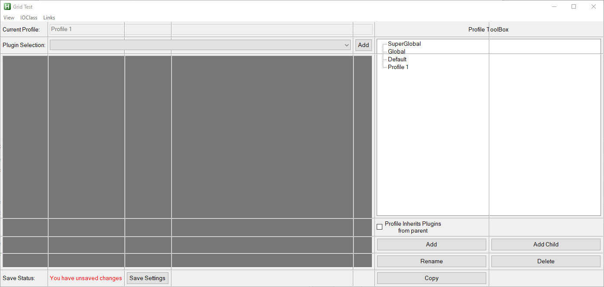

# GridGUI
<figure markdown="1">
Simplify Control Placement and Resizing
</figure>
---
<figure markdown="1">

**If you have ever felt that placing controls in a gui was too complicated or that you wished that you could reuse a previously started section in a gui this is the lib for you.**
</figure>

<figure markdown="1">
[How to Use](How to Use/){.md-button .align-center}
[Classe References](Classes/GridGUI.md){.md-button .align-center}
[Examples](Examples/Example 1.md){.md-button .align-center}
</figure>

##Features

!!! success "Relative Control Placement"
    Place controls relative to each other in a grid, where no two columns or two rows will overlap unless thay have zero area. Align controls without having to worry about coordinates.

!!! success "Auto Resizing"
    Never again do you need to painstakinly craft custom GuiSize labels, just tell the lib which controls should take up any unused space.

!!! success "Object Wrappers"
    Thin Object Wrappers for Window, Gui and Controls, that works like you are used to but with the convenience of class instances.

!!!	warning "What you are giving up"
	Computational power - *This library is computationally expensive.*
	
	Precise control - *This library handles the exact control placement.*
